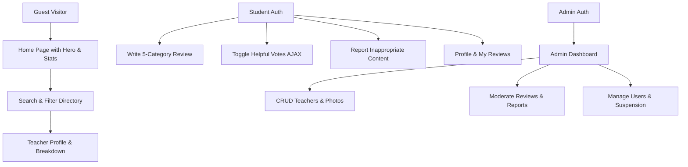

# BM3 Teacher Review Platform — Walkthrough & Documentation

The **BM3 (SMK Bina Mandiri Multimedia) Teacher Review Platform** is fully built, styled, tested, and seeded with realistic demo data.

---

## 🚀 How to Run the Website

In your terminal inside `c:\school stuff\Bm3 yelp`, run the following two commands:

### 1. Start the Laravel Server
```bash
php artisan serve
```
The website will be available at: **http://127.0.0.1:8000**

### 2. (Optional for live development) Start Vite Dev Server
```bash
npm run dev
```
*(Note: Production assets are already pre-compiled in `public/build/`, so `php artisan serve` works out-of-the-box even without running `npm run dev`!)*

---

## 🔑 Demo & Admin Accounts

The database is pre-seeded with Indonesian teacher profiles, realistic reviews, helpful votes, and accounts:

| Role | Username | Email | Password | Access / Capabilities |
|------|----------|-------|----------|-----------------------|
| **Admin** | `admin` | `admin@bm3.sch.id` | `password` | Full admin dashboard, add/edit/delete teachers with photos, suspend users, delete reviews, resolve/dismiss reports |
| **Student** | `student_demo` | `student@bm3.sch.id` | `password` | Write reviews, edit own reviews, vote helpful, report reviews, update profile/avatar |

*(There are also 30 other seeded student accounts with password `password`)*

---

## 🌟 Implemented Features & Architecture

### 1. Visual Design & Pixiv UI
- **Pixiv Visual Identity**: Iconic Pixiv Electric Blue (`#0096fa`), like/bookmark coral pink (`#ff4060`), ranking gold (`#ffaa00`), soft rounded cards (`16px`), and clean tag chips (`#Pemrograman Web`).
- **Pixiv-Style Navigation**: Distinctive brand badge (`bm3`), smooth pill buttons, and responsive drawer.
- **Pixiv Daily Ranking Badges**: Gold 🥇 #1, Silver 🥈 #2, and Bronze 🥉 #3 ranking badges for top-rated teachers.
- **Full Dark Mode**: Seamless Pixiv Dark theme support with `#121519` base, `#1b1f24` surfaces, neon blue highlights, and zero-flash initialization.
- **Theme Toggle**: Interactive navbar switch (☀️ / 🌙) that persists selection in `localStorage`.
- **PixiJS Canvas Particles**: Floating particle orbs matching the Pixiv palette (`#0096fa`, `#00c8ff`, `#ff4060`, `#ffaa00`).
- **Micro-Animations**: Animated number counters, star hover fill, star bounce on selection, and pulse on voting.

### 2. Core Modules & User Journeys



### 3. Rating & Review System
- **5 Rating Categories**: Overall, Teaching Quality, Explanation Clarity, Fairness, and Assignment Workload.
- **Dynamic Star Selector**: Interactive 1–5 star rating buttons with synchronized hidden form inputs.
- **Dynamic Calculation**: Averages are computed dynamically from published reviews with Eloquent queries (`whereHas` / `withAvg`).
- **Duplicate Prevention**: Database unique constraint + controller checks enforce one review per student per teacher.
- **Authorization**: Protected by `ReviewPolicy` so only the author can edit or delete their own review.

### 4. Helpful Voting & Moderation
- **AJAX Vote Toggle**: Click 👍 Helpful to toggle votes in real-time with CSRF protection and instant count update. Self-voting is strictly forbidden.
- **Reporting System**: Students can flag inappropriate reviews with 6 categorized reasons (`spam`, `harassment`, `offensive`, `personal_info`, `fake`, `other`).
- **Admin Moderation**: Admins can resolve reports (safely hiding inappropriate reviews while retaining audit trails) or dismiss reports.

### 5. Admin Dashboard
- **Metric Cards**: Total teachers, students, published reviews, pending flags.
- **Teacher CRUD**: Add/edit teachers with custom photo uploads or automatic initial avatar generation.
- **User Management**: View student activity, review counts, and toggle account suspension.

---

## 🧪 Automated Testing Verification

All 36 automated unit & feature tests pass cleanly:

```bash
php artisan test
```

**Results:**
- `Tests\Feature\Bm3PlatformTest`:
  - `test_guest_can_view_home_page` ✅
  - `test_guest_can_view_teacher_directory_and_filter` ✅
  - `test_guest_can_view_teacher_profile_with_ratings` ✅
  - `test_student_can_create_a_review` ✅
  - `test_student_cannot_submit_duplicate_review_for_same_teacher` ✅
  - `test_student_can_edit_own_review` ✅
  - `test_student_cannot_edit_another_users_review` ✅
  - `test_student_can_toggle_helpful_vote_on_review` ✅
  - `test_user_cannot_vote_on_own_review` ✅
  - `test_student_can_report_review` ✅
  - `test_student_cannot_access_admin_dashboard` ✅
  - `test_admin_can_access_dashboard_and_manage_teachers` ✅
  - `test_admin_can_resolve_reports` ✅
- `Tests\Feature\ProfileTest`: 3 passed ✅
- `Tests\Feature\Auth\*`: 19 passed ✅
- `Tests\Feature\ExampleTest`: 1 passed ✅

**Total: 36 passed, 94 assertions (100% success)**
